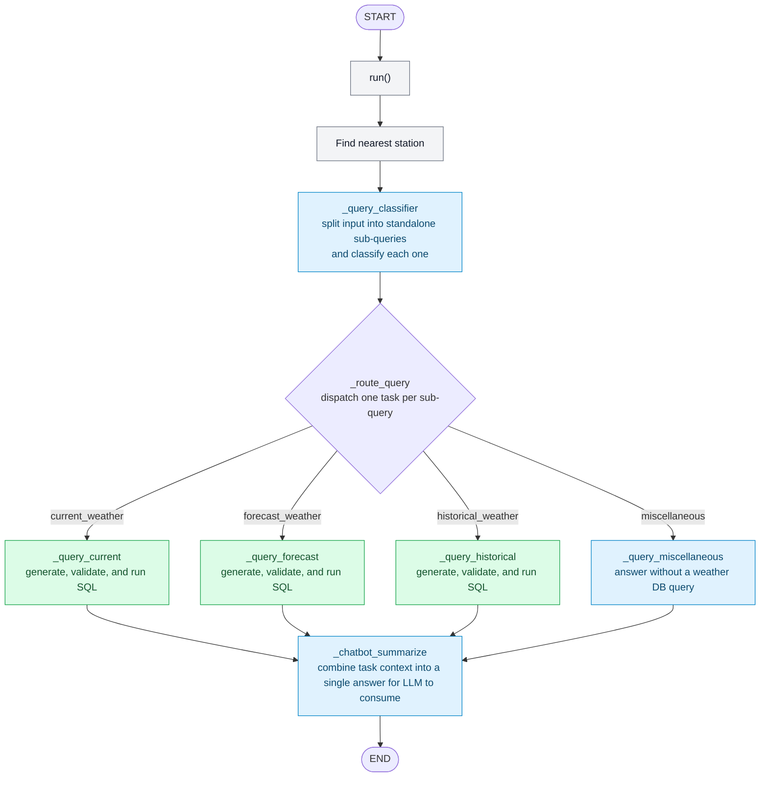

# Natural Language to SQL Workflow w/ Langgraph

## What is Langgraph?
- langgraph is a popular framework for organizing a workflow as a graph, where each specific task can be thought of as a node and the program passes data from one node to the next to complete the tasks. This abstraction can simplify complex programs and is often used with LLMs to separate context by task. Below is a high level overview of how this workflow operates in order to answer user questions.

## Workflow Overview

### Notes
- The nearest-station lookup is shown as a separate step for clarity, though it is performed inside `run()` before the graph is invoked.
- The classifier can produce multiple sub-queries; `_route_query` dispatches a task for each, so multiple query branches may run for one user input before converging at the summarizer.
- Weather query nodes retry SQL generation/execution up to three times when the database raises a programming error. This is adjusted with a class variable.

## Web integration

FastAPI constructs `LangGraphEngine` at startup using the configured OpenRouter clients. Weather requests use this adapter exclusively. The standalone vector retrieval scripts remain available but the web service has no vector fallback.

The existing map picker resolves a point to an active Washington station. A prepared turn stores that station, its accepted reference time and up to six recent exchanges. Each answer creates a fresh `ChatbotWorkflow` and closes its source connections when finished. The classifier determines the weather categories and dates before query nodes ask the model to generate SQL.

Generated queries must pass the SQL AST policy before execution. The policy allows a single SELECT against the selected station table, permits only public weather columns and caps results at 200 rows. Source connections start read only with a statement timeout. PostgreSQL continues to store conversations separately.

Set `OPENROUTER_API_KEY`, `AWN_DB_HOST`, `AWN_DB_USER` and `AWN_DB_PASSWORD` in the local environment. `OPENROUTER_WORKFLOW_MODEL` defaults to `OPENROUTER_CHAT_MODEL`; `OPENROUTER_CLASSIFIER_MODEL` defaults to the workflow model. The web weather service does not require an embedding model or a populated vector index.

Saved requests default to `mode: weather`. This path supplies recent conversation context directly to the graph without invoking the saved history classifier. Selecting Past conversations sends `mode: history` and searches only that browser's saved conversations. History mode cannot execute new weather queries. Retries keep the original operation, selected point and acceptance time.

Malformed classifier JSON receives one schema repair attempt with the original inputs. Repeated invalid output produces an interpretation error. Provider failures do not enter the repair loop. SQL validation still runs independently before any source query executes.
